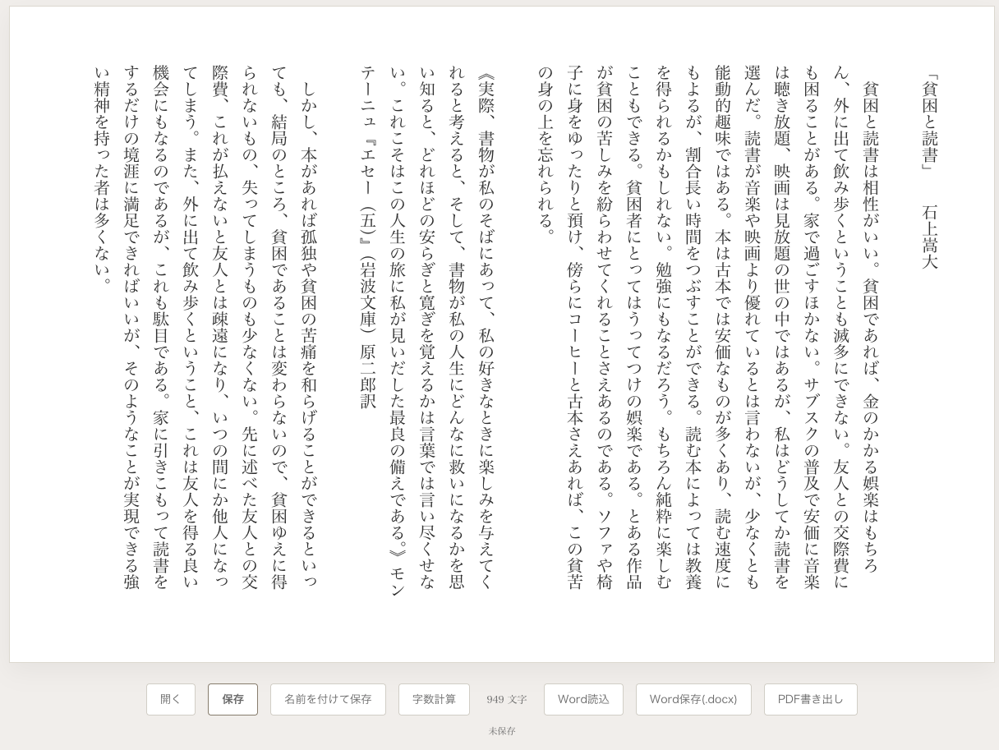

# Shippitsu(執筆)

シンプルな縦書きのテキストエディタです。Macで動作するデスクトップアプリ(Electron製)で、余計な機能を削ぎ落とし、執筆そのものに集中できることを目指しています。

## 主な機能

### 縦書き表示
原稿用紙のような縦書レイアウトで文章を入力できます。フォントは明朝体(Hiragino Mincho ProN / YuMincho)。

### ファイルの保存・読み込み
- 「保存」「名前を付けて保存」「開く」で、実際のファイル(`.txt`)として保存・読み込みができます
- `⌘S` で保存、`⌘⇧S` で名前を付けて保存
- 編集中の内容は60秒ごとにバックグラウンドで自動保存されるので、保存し忘れてアプリを閉じてしまった場合の保険になります(これはファイル保存の代わりではなく、あくまで保険です)

### Word連携
- **読み込み**: `.docx`ファイルからテキストを抜き出して読み込めます
- **保存**: 現在の文章を、縦書き設定済みの`.docx`として書き出せます(Wordで開くとそのまま縦書きで表示されます)

### PDF書き出し
PDFとして書き出せます。印刷用途を想定しています。

### メモ欄
画面左端の「MEMO」タブから、本文とは別に思考の断片やメモを書き留めておけるサイドパネルを呼び出せます。

### 字数計算
ボタン1つで、現在の文章の文字数(空白・改行を除く)を計測できます。

### オフライン動作
インターネット接続がない環境でも、Word連携を含めた全機能が動作します(外部サイトへの依存なし)。

### Apple Silicon対応
Intel Mac・Apple Silicon Mac(M1以降)の両方でネイティブに動作するUniversalバイナリです。

## ダウンロード

[Releases](../../releases) から最新の`.dmg`をダウンロードしてください。

⚠️ このアプリは署名・公証されていないため、初回起動時にmacOSのGatekeeperにブロックされます。開き方は各リリースページの説明を参照してください。

## 動作環境

macOS 12 (Monterey) 以降。

## 技術的なメモ

Electron製。レンダラー側(画面)からファイルシステムに直接アクセスしない、`contextIsolation`を有効にした構成です(`preload.js`経由でファイル保存・PDF書き出しのみを安全に橋渡し)。

## 支援

このツールが気に入ったら、[Amazonほしい物リスト](https://www.amazon.jp/hz/wishlist/ls/T5W4R43FK25P?ref_=wl_share) からの支援も歓迎しています。
